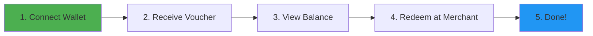
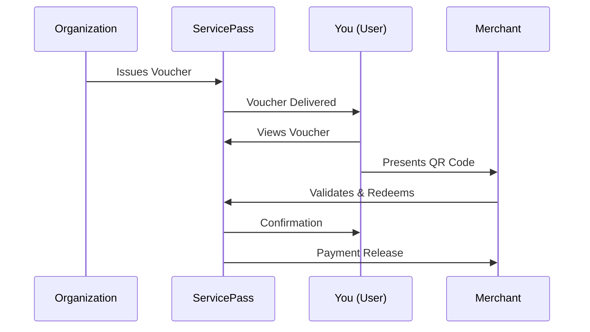
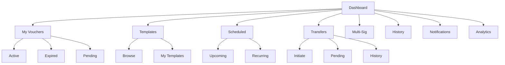
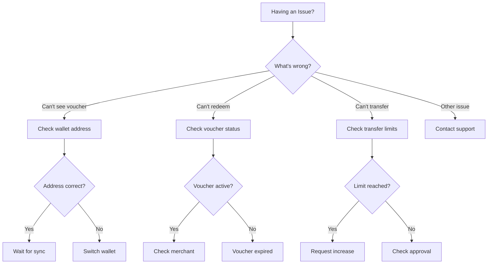

# ServicePass User Guide

**Version**: 1.0.0  
**Last Updated**: February 16, 2026  
**Support**: support@servicepass.io  
**Community**: [Discord](https://discord.gg/servicepass) | [Telegram](https://t.me/servicepass)

Welcome to ServicePass! This guide will help you understand and use the ServicePass platform to manage your vouchers effectively.

---

## 🚀 Quick Start (5 Minutes)

New to ServicePass? Follow these steps to get started immediately:



### Your First 5 Minutes

1. **Connect** → Click "Connect Wallet" and select your SUI wallet
2. **Receive** → Your organization will send you vouchers
3. **View** → Check your dashboard to see your vouchers
4. **Use** → Visit a participating merchant to redeem
5. **Track** → View your redemption history

**Watch**: [5-Minute Getting Started Video](https://youtube.com/servicepass/getting-started) 📺

---

## 📹 Video Tutorials

Learn ServicePass visually with our video guides:

| Topic | Duration | Link |
|-------|----------|------|
| 🎬 Getting Started | 5 min | [Watch Now](https://youtube.com/servicepass/getting-started) |
| 💳 Managing Vouchers | 8 min | [Watch Now](https://youtube.com/servicepass/managing-vouchers) |
| 🔄 Partial Redemptions | 6 min | [Watch Now](https://youtube.com/servicepass/partial-redemptions) |
| 📤 Transferring Vouchers | 7 min | [Watch Now](https://youtube.com/servicepass/transfers) |
| 🛠️ Advanced Features | 12 min | [Watch Now](https://youtube.com/servicepass/advanced-features) |
| 🔔 Notification Setup | 4 min | [Watch Now](https://youtube.com/servicepass/notifications) |

**Full Playlist**: [ServicePass Complete Tutorial Series](https://youtube.com/servicepass/playlist)

---

## Table of Contents

1. [What is ServicePass?](#what-is-servicepass)
2. [Getting Started](#getting-started)
3. [Managing Your Account](#managing-your-account)
4. [Understanding Vouchers](#understanding-vouchers)
5. [Using Your Vouchers](#using-your-vouchers)
6. [Voucher Templates](#voucher-templates)
7. [Scheduled Vouchers](#scheduled-vouchers)
8. [Transfer Management](#transfer-management)
9. [Multi-Signature Operations](#multi-signature-operations)
10. [Notifications](#notifications)
11. [Quick Reference Cards](#quick-reference-cards)
12. [Troubleshooting](#troubleshooting)
13. [FAQ](#faq)

---

## What is ServicePass?

ServicePass is a blockchain-based voucher system that allows you to receive, manage, and redeem digital vouchers for real-world services and goods. Built on the SUI blockchain, ServicePass ensures transparency, security, and accountability for all transactions.

### How It Works



### Key Benefits

✅ **Secure** - All vouchers are stored on the blockchain  
✅ **Transparent** - Complete transaction history available  
✅ **Targeted** - Vouchers can only be used for specific service types  
✅ **Flexible** - Support for partial redemptions and transfers  
✅ **Accountable** - Full audit trail of all activities

### Voucher Types

ServicePass supports four types of vouchers:

- **🎓 Education (EDU)** - School fees, exams, training courses
- **🏥 Healthcare (HEALTH)** - Clinic visits, lab tests, medicines
- **🚌 Transport (TRANSPORT)** - Bus passes, taxi rides, fuel
- **🌾 Agriculture (AGRI)** - Seeds, fertilizer, veterinary services

---

## Getting Started

### 1. Creating Your Account

1. **Visit the ServicePass Platform**
   - Go to [https://app.servicepass.io](https://app.servicepass.io)
   
2. **Connect Your Wallet**
   - Click "Connect Wallet" in the top right
   - Select your SUI wallet provider (Sui Wallet, Ethos, etc.)
   - Approve the connection request
   
3. **Register Your Account**
   - Enter your email address
   - Create a secure password (minimum 8 characters)
   - Enter your full name
   - Click "Register"
   
4. **Verify Your Email**
   - Check your inbox for a verification email
   - Click the verification link
   - Your account is now active!

### 2. Understanding Your Dashboard

After logging in, you'll see your dashboard with:

- **Total Balance** - Combined value of all your vouchers
- **Active Vouchers** - Number of vouchers you can use
- **Expired Vouchers** - Vouchers that have passed their expiry date
- **Recent Activity** - Latest redemptions and transactions
- **Voucher Breakdown** - Vouchers organized by type

### Dashboard Navigation Map



---

## Managing Your Account

### Viewing Your Profile

1. Click your wallet address in the top right corner
2. Select "My Profile"
3. View your account information:
   - Email address
   - Wallet address
   - Account creation date
   - Total transactions

### Changing Your Password

1. Go to "My Profile"
2. Click "Change Password"
3. Enter your current password
4. Enter your new password
5. Confirm your new password
6. Click "Update Password"

### Updating Notification Preferences

See the [Notifications](#notifications) section for detailed instructions.

---

## Understanding Vouchers

### Voucher Details

Each voucher contains:

- **Voucher ID** - Unique blockchain identifier
- **Amount** - Total value of the voucher
- **Remaining Balance** - Current available balance
- **Type** - Category (Education, Health, Transport, Agriculture)
- **Status** - Current state (Active, Expired, Redeemed)
- **Expiry Date** - When the voucher expires
- **Merchant** - Who issued the voucher
- **Created Date** - When you received the voucher

### Voucher Status

| Status | Description |
|--------|-------------|
| **Active** | Voucher is valid and can be used |
| **Partially Redeemed** | Some of the voucher has been used |
| **Redeemed** | Voucher has been fully used |
| **Expired** | Voucher has passed its expiry date |
| **Transferred** | Voucher has been transferred to another user |

### Viewing Your Vouchers

1. Click "My Vouchers" in the navigation menu
2. Use filters to view specific vouchers:
   - **All** - Show all vouchers
   - **Active** - Show only usable vouchers
   - **Expired** - Show expired vouchers
3. Click on any voucher card to see full details

---

## Using Your Vouchers

### Full Redemption

If you want to use the entire voucher value:

1. Go to "My Vouchers"
2. Click on the voucher you want to use
3. Click "Generate QR Code"
4. Show the QR code to the merchant
5. Merchant scans and processes the redemption
6. You'll receive a confirmation notification

### Partial Redemption

For vouchers that support partial redemption:

1. Go to "My Vouchers"
2. Click on the voucher
3. Click "Redeem Partially"
4. Enter the amount to redeem
5. Add a description (optional)
6. Click "Generate QR Code"
7. Show QR code to merchant
8. Remaining balance stays on your voucher

### QR Code Security

**Important Security Features:**
- QR codes are digitally signed
- Each QR code is time-limited (valid for 5 minutes)
- QR codes can only be used once
- Tampering is detected automatically

**Best Practices:**
- Generate QR codes only when ready to use
- Don't screenshot or share QR codes
- Verify merchant identity before showing code
- Check redemption confirmation

### Viewing Redemption History

1. Click "Redemption History" in the menu
2. View all your past transactions:
   - Date and time
   - Merchant name
   - Amount redeemed
   - Remaining balance
   - Transaction hash (blockchain proof)
3. Click on any transaction for details
4. Click "View on Blockchain" to see blockchain record

---

## Voucher Templates

Templates allow you to quickly create vouchers with predefined settings.

### Browsing Templates

1. Click "Templates" in the navigation menu
2. Browse available templates
3. Filter by:
   - Category (Education, Health, Transport, Agriculture)
   - Status (Active/Inactive)
4. Click "View Details" to see template information

### Template Information

Each template shows:
- **Name** - Template description
- **Category** - Voucher type
- **Default Amount** - Suggested voucher value
- **Default Expiry** - Standard validity period
- **Partial Redemption** - Whether it's allowed
- **Transfer Restrictions** - Transfer rules
- **Usage Count** - How many times it's been used

### Using Templates (Admin Only)

If you're an administrator:

1. Select a template
2. Click "Use Template"
3. Enter recipient details
4. Modify amount/expiry if needed
5. Click "Create Voucher"

---

## Scheduled Vouchers

Schedule vouchers to be automatically issued at future dates.

### Creating a Schedule

1. Click "Scheduled Vouchers" in the menu
2. Click "Create New Schedule"
3. Fill in the form:
   - **Template** - Select voucher template
   - **Recipient** - Wallet address
   - **Amount** - Voucher value
   - **First Issuance Date** - When first voucher issues
   - **Recurrence** (optional):
     - Enable recurring issuance
     - Select frequency (Daily, Weekly, Monthly, Yearly)
     - Set interval (e.g., every 2 weeks)
     - Set end date
4. Click "Create Schedule"

### Managing Schedules

**View Your Schedules:**
1. Go to "Scheduled Vouchers"
2. View all active and completed schedules
3. Filter by status:
   - **Active** - Currently running schedules
   - **Completed** - Finished schedules
   - **Cancelled** - Cancelled schedules

**Cancel a Schedule:**
1. Click on the schedule
2. Click "Cancel Schedule"
3. Confirm cancellation
4. Scheduled vouchers will stop issuing

**Trigger Manually:**
1. Click on the schedule
2. Click "Trigger Now"
3. Voucher will be issued immediately
4. Next scheduled issuance remains unchanged

### Schedule Stats

View statistics for your schedules:
- Total schedules created
- Active schedules
- Completed schedules
- Total vouchers issued
- Next upcoming issuance

---

## Transfer Management

Transfer vouchers to other users securely.

### Initiating a Transfer

1. Go to "Transfer Management"
2. Click "Create Transfer"
3. Fill in transfer details:
   - **Voucher** - Select voucher to transfer
   - **Recipient Address** - Receiver's wallet address
   - **Amount** - Full or partial amount
   - **Requires Approval** - Check if approval needed
   - **Reason** - Description of transfer
4. Click "Create Transfer"

### Transfer Restrictions

Some vouchers have transfer restrictions:
- **Maximum Transfers** - Limited number of times it can be transferred
- **Approval Required** - Admin/merchant must approve
- **Allowed Recipients** - Only specific addresses can receive
- **Transfer Limit** - Maximum amount per transfer

### Tracking Transfers

**View Transfer History:**
1. Go to "Transfer Management"
2. View all your transfers:
   - Transfers you initiated
   - Transfers you received
   - Pending approvals
3. Filter by status:
   - **Pending** - Awaiting approval
   - **Approved** - Approved but not completed
   - **Completed** - Successfully transferred
   - **Rejected** - Approval denied

**Check Transfer Status:**
1. Click on any transfer
2. View details:
   - Current status
   - Approval progress
   - Transaction hash (if completed)
   - Rejection reason (if rejected)

### Approving Transfers (Admin/Merchant)

If you're an admin or merchant:

1. Go to "Transfer Management"
2. Click "Pending Approvals" tab
3. Review transfer request details
4. Click "Approve" or "Reject"
5. Add reason (for rejection)
6. Confirm action

---

## Multi-Signature Operations

For critical operations requiring multiple approvals.

### Understanding Multi-Sig

Multi-signature operations require multiple administrators to approve before execution. This adds security for sensitive actions like:
- Large voucher batch creations
- System configuration changes
- Emergency operations
- Merchant status changes

### Viewing Operations

1. Go to "Multi-Sig Operations"
2. View all operations:
   - Operations awaiting your signature
   - Operations you created
   - Completed operations
3. Filter by:
   - **Pending** - Awaiting signatures
   - **Approved** - All signatures collected
   - **Executed** - Successfully completed
   - **Rejected** - Denied by admin
   - **Cancelled** - Cancelled by creator

### Signing Operations (Admin Only)

If you're an administrator:

1. Click on a pending operation
2. Review details:
   - Operation type
   - Voucher information
   - Required signatures
   - Current signatures
   - Expiry time
3. Click "Sign" to approve
4. Add comment (optional)
5. Confirm signature

**Note:** Operations automatically execute when all required signatures are collected.

### Rejecting Operations (Admin Only)

1. Click on a pending operation
2. Click "Reject"
3. Enter rejection reason
4. Confirm rejection
5. Operation is cancelled

### Creating Multi-Sig Operations (Admin Only)

1. Click "Create Operation"
2. Select operation type
3. Fill in details:
   - Voucher ID (if applicable)
   - Required signatures (2-3)
   - Expiry date
   - Additional metadata
4. Click "Create Operation"
5. Operation is created and awaits signatures

---

## Notifications

Stay informed about your voucher activities.

### Notification Channels

ServicePass supports three notification channels:

- **📧 Email** - Notifications sent to your email
- **📱 SMS** - Text message notifications
- **🔔 Push** - Browser push notifications

### Managing Preferences

1. Click "Notifications" in the menu
2. Toggle channels on/off:
   - Enable/disable Email notifications
   - Enable/disable SMS notifications
   - Enable/disable Push notifications
3. Customize notification types:
   - **Voucher Received** - When you get a new voucher
   - **Redemption Confirmed** - After using a voucher
   - **Expiry Reminder** - Before voucher expires
   - **Transfer Update** - Transfer status changes
   - **Schedule Triggered** - Scheduled voucher issued
4. Set expiry reminder timing:
   - 7 days before expiry (default)
   - 14 days before expiry
   - 30 days before expiry
5. Click "Save Preferences"

### Testing Notifications

Verify your notification channels work:

1. Go to "Notifications"
2. Click "Test Email" to send test email
3. Click "Test SMS" to send test SMS
4. Click "Test Push" to send test push notification
5. Check that you receive the test messages

### Viewing Notification History

1. Go to "Notifications"
2. Click "History" tab
3. View all notifications:
   - Date and time sent
   - Notification type
   - Channel used
   - Delivery status
4. Filter by:
   - Channel (Email, SMS, Push)
   - Status (Sent, Failed, Pending)
   - Date range

### Enabling Push Notifications

**For Browser Push Notifications:**

1. Go to "Notifications"
2. Enable "Push Notifications"
3. Click "Allow" when browser asks for permission
4. Your device is now registered
5. You'll receive push notifications when browser is open

**Supported Browsers:**
- Chrome/Edge (Desktop & Android)
- Firefox (Desktop & Android)
- Safari (Desktop & iOS)

---

## Quick Reference Cards

### 📋 Voucher Status Guide

| Status | Icon | Meaning | Action Available |
|--------|------|---------|------------------|
| **Active** | 🟢 | Ready to use | Redeem, Transfer |
| **Partially Redeemed** | 🟡 | Some balance used | Continue redeeming |
| **Pending Transfer** | 🔄 | Transfer in progress | Wait for approval |
| **Expired** | 🔴 | Past expiry date | Contact issuer |
| **Redeemed** | ✅ | Fully used | View history only |

### 💰 Redemption Quick Reference

```
┌────────────────────────────────────────┐
│  REDEMPTION PROCESS                    │
├────────────────────────────────────────┤
│  1. Select voucher                     │
│  2. Show QR code to merchant           │
│  3. Merchant scans & confirms amount   │
│  4. Approve transaction                │
│  5. Receive confirmation               │
│  ├─ Full: Voucher marked as redeemed  │
│  └─ Partial: Balance updated           │
└────────────────────────────────────────┘
```

###  🔑 Keyboard Shortcuts

| Shortcut | Action |
|----------|--------|
| `Ctrl + D` | Go to Dashboard |
| `Ctrl + V` | View Vouchers |
| `Ctrl + H` | View History |
| `Ctrl + N` | View Notifications |
| `Ctrl + K` | Open Command Palette |
| `Ctrl + /` | Open Help |
| `Esc` | Close Modal |

### 📱 Mobile App Features

**Download**: [iOS App Store](https://apps.apple.com/servicepass) | [Google Play](https://play.google.com/servicepass)

| Feature | Available | Notes |
|---------|-----------|-------|
| View Vouchers | ✅ | Full support |
| Generate QR Codes | ✅ | Offline capable |
| Redeem at Merchants | ✅ | With merchant app |
| Transfer Vouchers | ✅ | Requires internet |
| View Analytics | ✅ | Full dashboard |
| Biometric Login | ✅ | Face ID / Fingerprint |
| Push Notifications | ✅ | Real-time alerts |

### 🎯 Common Tasks Cheat Sheet

**Check Your Balance:**
```
Dashboard → Total Balance (top card)
```

**Find a Merchant:**
```
Menu → Merchants → Search by name or location
```

**Redeem a Voucher:**
```
My Vouchers → Select voucher → Show QR Code → Let merchant scan
```

**Transfer to Someone:**
```
My Vouchers → Select voucher → Transfer → Enter recipient wallet address
```

**View History:**
```
History → Filter by date/type → Export if needed
```

**Enable Notifications:**
```
Profile → Notification Preferences → Toggle channels on/off
```

### 🆘 Emergency Contact Card

```
╔════════════════════════════════════════╗
║  SERVICEPASS SUPPORT                   ║
╠════════════════════════════════════════╣
║  📧 Email: support@servicepass.io      ║
║  💬 Live Chat: app.servicepass.io/chat ║
║  📞 Phone: +1-555-SERVICE (24/7)       ║
║  🌐 Help Center: help.servicepass.io   ║
╠════════════════════════════════════════╣
║  EMERGENCY ISSUES:                     ║
║  - Lost vouchers                       ║
║  - Unauthorized transactions           ║
║  - Account lockout                     ║
║  Response time: < 1 hour               ║
╚════════════════════════════════════════╝
```

### 🔐 Security Checklist

Quick daily security check:

- [ ] Wallet is locked when not in use
- [ ] Password is unique and strong
- [ ] Two-factor authentication enabled
- [ ] Recent transactions look correct
- [ ] No suspicious activity in history
- [ ] Email notifications are arriving
- [ ] Wallet address hasn't changed unexpectedly

**If any item is suspicious**: Contact support immediately at emergency@servicepass.io

### 📊 Voucher Type Quick Reference

| Type | Use For | Typical Amount | Expiry Period |
|------|---------|----------------|---------------|
| 🎓 **EDU** | School fees, Exams, Training | $50-500 | 3-12 months |
| 🏥 **HEALTH** | Clinic visits, Medicines | $20-200 | 1-6 months |
| 🚌 **TRANSPORT** | Bus, Taxi, Fuel | $10-100 | 1-3 months |
| 🌾 **AGRI** | Seeds, Fertilizer, Tools | $30-300 | 6-12 months |

### 🔔 Notification Types

| Type | When | Action Required |
|------|------|-----------------|
| 📨 **Voucher Received** | New voucher issued | View voucher |
| ⚠️ **Expiring Soon** | 7 days before expiry | Use voucher |
| ✅ **Redemption Complete** | Voucher used | Check history |
| 🔄 **Transfer Pending** | Transfer needs approval | Approve/reject |
| 🔐 **Security Alert** | Suspicious activity | Review account |
| 📊 **Weekly Summary** | Every Monday | Review activity |

---

## Troubleshooting

### Interactive Troubleshooting Guide



### Common Issues

#### Can't Connect Wallet

**Problem:** Wallet connection fails  
**Solution:**
1. Ensure you have a SUI wallet installed
2. Check that wallet is unlocked
3. Try refreshing the page
4. Clear browser cache
5. Try a different browser

#### Voucher Not Showing

**Problem:** Expected voucher isn't visible  
**Solution:**
1. Check wallet address is correct
2. Wait a few minutes for blockchain confirmation
3. Click "Refresh" on vouchers page
4. Check if voucher is filtered out
5. Contact support with transaction hash

#### QR Code Won't Generate

**Problem:** Can't create QR code for redemption  
**Solution:**
1. Check voucher is active (not expired)
2. Verify sufficient balance
3. Ensure merchant is authorized
4. Try refreshing the page
5. Check internet connection

#### Redemption Failed

**Problem:** Merchant can't redeem voucher  
**Solution:**
1. Verify merchant is authorized for voucher type
2. Check voucher balance is sufficient
3. Ensure QR code hasn't expired (5-minute limit)
4. Generate new QR code
5. Verify merchant has valid API key

#### Transfer Stuck in Pending

**Problem:** Transfer not completing  
**Solution:**
1. Check if transfer requires approval
2. Wait for admin/merchant approval
3. Verify recipient address is correct
4. Check transfer restrictions
5. Contact support if pending >24 hours

#### Notifications Not Received

**Problem:** Not getting notification emails/SMS  
**Solution:**
1. Check notification preferences are enabled
2. Verify email/phone number is correct
3. Check spam/junk folder for emails
4. Test notification channels
5. Wait 5 minutes and try again

### Getting Help

#### Support Channels

- **Email Support**: support@servicepass.io
- **Live Chat**: Available in app (bottom right)
- **Documentation**: https://docs.servicepass.io
- **Community Forum**: https://forum.servicepass.io

#### When Contacting Support

Please provide:
1. Your wallet address
2. Description of the issue
3. Screenshots (if applicable)
4. Transaction hash (if relevant)
5. Steps you've already tried

**Response Times:**
- Email: Within 24 hours
- Live Chat: During business hours (9 AM - 5 PM EAT)
- Critical Issues: Within 4 hours

---

## FAQ

### General Questions

**Q: Is ServicePass free to use?**  
A: Yes, receiving and managing vouchers is free. Blockchain transaction fees are covered by the voucher issuer.

**Q: Do I need cryptocurrency to use ServicePass?**  
A: No, you don't need to buy cryptocurrency. All blockchain fees are paid by voucher issuers and merchants.

**Q: Can I convert vouchers to cash?**  
A: No, vouchers are non-refundable and can only be used for their designated service type to prevent misuse.

**Q: What happens to expired vouchers?**  
A: Expired vouchers cannot be redeemed and their value is lost. Enable expiry reminders to avoid missing deadlines.

**Q: Are my vouchers safe?**  
A: Yes, vouchers are secured on the blockchain and protected by your wallet's private key. Never share your private key.

### Account Questions

**Q: Can I have multiple accounts?**  
A: Yes, but each wallet address can only be linked to one account.

**Q: How do I change my email address?**  
A: Contact support to update your email address for security verification.

**Q: I forgot my password. What do I do?**  
A: Use the "Forgot Password" link on the login page to reset your password via email.

**Q: Can I delete my account?**  
A: Yes, contact support to request account deletion. Your blockchain transaction history remains public.

### Voucher Questions

**Q: Can I use a voucher multiple times?**  
A: Yes, if the voucher supports partial redemption. Otherwise, it's one-time use.

**Q: What if I only need to use part of a voucher?**  
A: Use the "Redeem Partially" feature to use only what you need and save the rest.

**Q: Can I transfer a voucher to someone else?**  
A: Yes, if the voucher allows transfers. Some vouchers have transfer restrictions.

**Q: Why can't I use an Education voucher at a health clinic?**  
A: Vouchers are type-specific to ensure funds are used for their intended purpose.

**Q: How do I know if a merchant is legitimate?**  
A: All merchants are verified by ServicePass administrators before they can accept vouchers.

### Redemption Questions

**Q: How long is a QR code valid?**  
A: QR codes expire after 5 minutes for security. Generate a new one if needed.

**Q: Can I redeem a voucher online?**  
A: Currently, redemptions must be done in-person at merchant locations using QR codes.

**Q: What if the merchant says the QR code doesn't work?**  
A: Generate a new QR code. If the problem persists, check voucher status and balance.

**Q: Can I cancel a redemption?**  
A: No, redemptions are final and cannot be reversed once completed on the blockchain.

**Q: Will I get a receipt?**  
A: Yes, you'll receive a digital receipt with the transaction hash as proof of redemption.

### Technical Questions

**Q: What blockchain does ServicePass use?**  
A: ServicePass is built on the SUI blockchain using the Move programming language.

**Q: Can I see my transactions on the blockchain?**  
A: Yes, click on any transaction to view it on the SUI blockchain explorer.

**Q: What happens if the blockchain is down?**  
A: The system will retry failed transactions automatically. Your vouchers remain safe.

**Q: Is my personal data stored on the blockchain?**  
A: No, only transaction data is on the blockchain. Personal information is stored securely off-chain.

**Q: Can merchants see my personal information?**  
A: Merchants only see your wallet address and transaction details, not your personal information.

---

## Best Practices

### Security

✅ **Do:**
- Keep your wallet private key secure
- Log out when using public computers
- Enable all notification channels
- Verify merchant identity before redemption
- Check transaction confirmations

❌ **Don't:**
- Share your password or private key
- Screenshot or share QR codes
- Ignore expiry date warnings
- Use expired vouchers
- Transfer vouchers to unknown addresses

### Voucher Management

✅ **Do:**
- Check vouchers regularly
- Enable expiry reminders
- Use partial redemptions when possible
- Keep track of redemption history
- Update notification preferences

❌ **Don't:**
- Let vouchers expire unused
- Generate QR codes too early
- Ignore transfer restrictions
- Attempt to redeem at wrong merchant types
- Forget to verify redemption confirmations

### Support

✅ **Do:**
- Read FAQ before contacting support
- Provide detailed information
- Include transaction hashes
- Be patient with responses
- Follow up if needed

❌ **Don't:**
- Submit duplicate support requests
- Share private keys with anyone
- Expect instant responses outside business hours
- Provide false information
- Abuse support channels

---

## Glossary

- **Blockchain** - Distributed ledger technology securing all transactions
- **Wallet** - Digital container for your blockchain address and keys
- **Voucher** - Digital token representing prepaid credits
- **Redemption** - Using a voucher to pay for services
- **QR Code** - Quick Response code for secure voucher redemption
- **Merchant** - Service provider accepting vouchers
- **Transaction Hash** - Unique identifier for blockchain transactions
- **Partial Redemption** - Using only part of a voucher's value
- **Transfer** - Moving a voucher to another user
- **Multi-Sig** - Requiring multiple approvals for operations
- **Template** - Reusable voucher configuration
- **Schedule** - Automated future voucher issuance

---

## Quick Reference

### Important Links

- **Platform**: https://app.servicepass.io
- **Documentation**: https://docs.servicepass.io
- **Support**: support@servicepass.io
- **Status Page**: https://status.servicepass.io
- **GitHub**: https://github.com/davelee001/ServicePass

### Keyboard Shortcuts

| Shortcut | Action |
|----------|--------|
| `Ctrl/Cmd + K` | Search |
| `Ctrl/Cmd + N` | New voucher (admin) |
| `Ctrl/Cmd + R` | Refresh vouchers |
| `Ctrl/Cmd + H` | View history |
| `Ctrl/Cmd + /` | Show shortcuts |

### Support Hours

- **Email Support**: 24/7 (Response within 24 hours)
- **Live Chat**: Mon-Fri, 9 AM - 5 PM EAT
- **Emergency Support**: 24/7 for critical issues

---

**Thank you for using ServicePass!**

For additional help, visit our [Documentation](https://docs.servicepass.io) or [contact support](mailto:support@servicepass.io).

*Last Updated: February 16, 2026*
